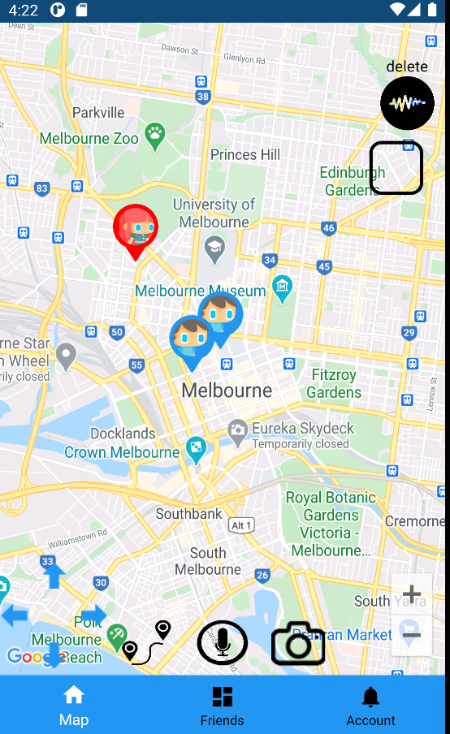

## MeetApp
A map-based Android mobile app to meet people in the city.

## Context
- This app was part of the subject Mobile Computing at University of Melbourne.
- The project was carried out by 6 members.
- One important objective was the utilization of multiple sensors in the smartphone. This app is focused in localization features.

## Youtube link
[link](https://www.youtube.com/watch?v=6yERVG7UeoM&feature=youtu.be)

## Build with
- Android Studio 4.1
- Android SDK version 30.0.2
- Gradle 4.1.

## General characteristics:
- The application was built with Android Studio 4.1 and mainly tested in that version. 
- The main dependency of the project is Gradle 4.1. There are many other dependencies that
they should be resolved in the Gradle synchronisation process.
- This project uses Firebase as database, but it is not required further configuration for 
execute the source code.

## This project was tested in several smartphones, for example:
- (virtual) Pixel 2
- (virtual) Nexus 5
- (real) Xiaomi Pocophone f1
- (real) One Plus 3 